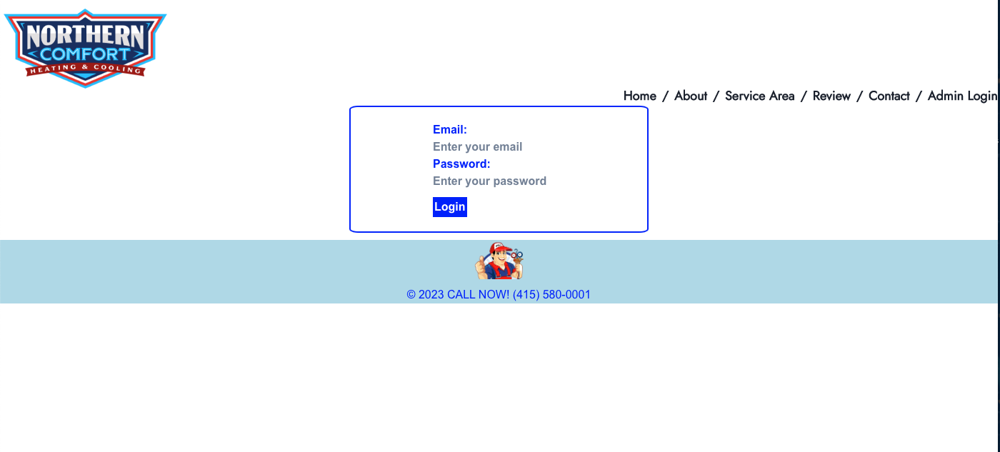

 

    
    
    
    
     
     

## Table of Contents

- [Overview](#overview)
- [Built With](#built-with)
- [License](#license)
- [Features](#features)
- [Contact](#contact)
- [Acknowledgements](#acknowledgements)

## Overview

[Live Link Coming Soon!]()

Northern Comfort is our application designed to streamline and enhance the HVAC service experience for users. As a leading HVAC business, our platform provides users with easy access to a wide range of HVAC services and valuable information about their availability in the area of ARLINGTON, WA.

## Features

***Key Features:***
 

* Services: Browse through a wide range of HVAC services provided by Northern Comfort, including installation, repairs, maintenance, and consultations.

* Contact: Get in touch with their team directly through the application for any inquiries or additional information.

* Reviews: Read and write reviews and testimonials from satisfied customers who have used Northern Comfort.

* Admin Logging: Feature that allows authorized personnel to access and view important activities and system changes within the application.
* Feel free to check out admin functionality with the test user: admin@example.com / password

### Built With

1.     [nodeJS](https://nodejs.org/en/docs/)

2.     [React](https://react.dev/)

3.     [MongoDB](https://www.mongodb.com/)

4.      [JavaScript](https://devdocs.io/javascript/)

5.    [Express](https://expressjs.com/)

6.    [JSON Web Token](https://jwt.io/)

### License

 

Copyright © 2007 Free Software Foundation, Inc. <https://fsf.org/>

Everyone is permitted to copy and distribute verbatim copies of this license document, but changing it is not allowed.(https://react.dev/)
 

## Contact

If you would like to contribute or have any questions , please contact us through 
 
 
**GitHub**:

 [Heather Greenberg](https://github.com/hngreenberg)

 [George Semfield](https://github.com/gosem01)

 [Adrian Mora](mailto:moraadrian510@icloud.com)

**Thank You for your feedback!!**

---

